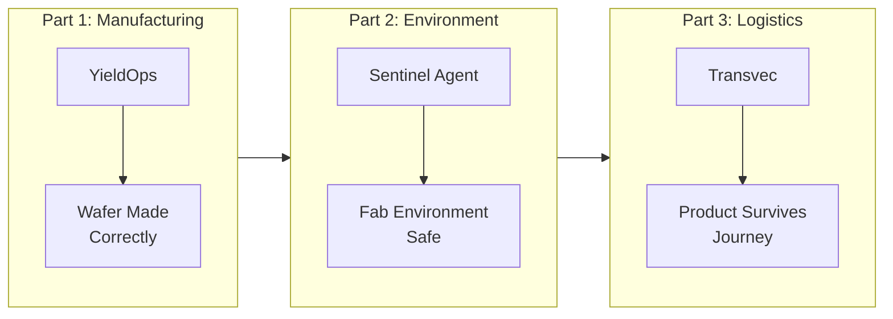
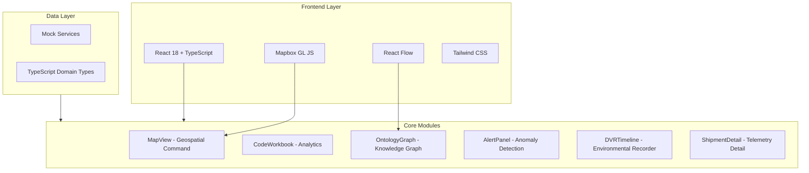
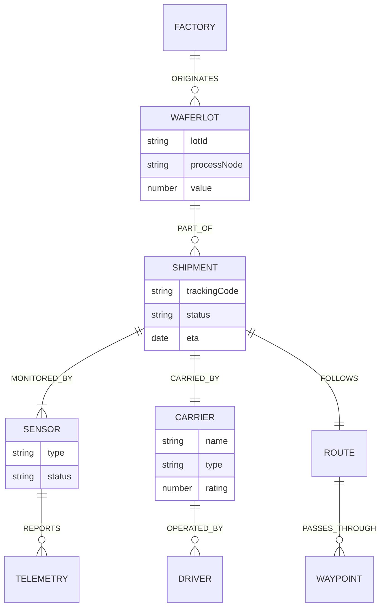

# Transvec

**Global Logistics Intelligence & Supply Chain Digital Twin**

> *"From Silicon to System: The Journey After the Fab."*

---

## Overview

Transvec is a high-fidelity logistics intelligence platform designed for the semiconductor and high-tech manufacturing sectors. It serves as **Part 3** of the YieldOps ecosystem, tracking critical assets after they leave the manufacturing floor.

### The YieldOps Ecosystem



| Phase | System | Purpose |
|-------|--------|---------|
| **Part 1** | YieldOps | Ensures the wafer is made correctly |
| **Part 2** | Sentinel Agent | Ensures the fab environment is safe |
| **Part 3** | **Transvec** | **Ensures the final product survives the journey** |

---

## Architecture



---

## Features

### 1. Operational View (Map)

- Real-time geospatial tracking via Mapbox GL JS with 3D buildings and dark theme
- Multi-modal transport markers (Air / Sea / Land) with status-based color coding
- Click-to-select markers with live telemetry popups (shock, temp, humidity, vibration)
- Route visualization from origin to current location
- Live statistics overlay: total assets, in-transit count, delivered, critical alerts
- Animated pulse indicators on critical shipments

### 2. Shipment Detail Panel

- Real-time telemetry cards with threshold-based severity coloring
- Multi-modal journey timeline with leg-by-leg progress (AIR / SEA / LAND)
- Active sensor inventory with status indicators
- Wafer lot tracking with associated value
- One-click DVR launch for environmental playback

### 3. Code Workbook (Jupyter-style)

- Interactive Python notebook interface with markdown and code cells
- Custom syntax highlighter for Python (keywords, strings, comments, functions)
- Simulated execution with loading state and mock output display
- Pre-loaded analysis cells: shock anomaly detection (Isolation Forest), ETA prediction

### 4. Ontology Graph

- React Flow-powered node graph with typed nodes (Factory, WaferLot, Shipment, Carrier, Route, Sensor)
- Color-coded nodes with animated labeled edges
- Expand/collapse node relationships
- MiniMap navigator and pan/zoom controls
- Cypher query input panel (UI scaffold for Neo4j integration)
- Node and edge statistics display

### 5. Alert Center

- Severity-based filtering: Critical / Warning / Info
- Real-time alert statistics dashboard
- Alert acknowledgment with toggle to show/hide acknowledged items
- Detailed alert inspection panel with shipment linking
- Alert types: Route Deviation, Shock Threshold, Temperature Excursion, Geofence Breach, Delayed Arrival, Sensor Offline

### 6. Environmental DVR

- Full-screen modal with synchronized map replay and sensor graphs
- Three animated SVG time-series: Shock (with 3G threshold), Temperature (with 25C threshold), Vibration
- Transport controls: Play/Pause, Skip +/-10 frames, Timeline scrubber
- Variable playback speeds: 0.5x, 1x, 2x, 4x
- Auto-generated event log with anomaly markers (SHOCK, TEMP, VIBRATION)
- 200-point synthetic telemetry dataset per shipment

---

## Tech Stack

| Layer | Technology | Purpose |
|-------|------------|---------|
| **Framework** | React 18 + TypeScript | Type-safe component architecture |
| **Build** | Vite 6 | Fast HMR, optimized production builds |
| **Styling** | Tailwind CSS 3.4 | Utility-first, Palantir-inspired dark theme |
| **Geospatial** | Mapbox GL JS 3.9 | 3D map rendering, marker management |
| **Graph** | React Flow | Node-edge graph visualization |
| **Charts** | Custom SVG | Lightweight, zero-dependency sensor graphs |
| **Fonts** | Inter + JetBrains Mono | UI typography + monospace data display |

### Dependency Notes

The following packages are included in `package.json` for future use but are **not yet active** in the current build:

| Package | Status | Planned Use |
|---------|--------|-------------|
| `recharts` | Installed, unused | Dashboard-level analytics charts |
| `react-map-gl` | Installed, unused | Declarative map wrapper (MapView uses Mapbox GL directly) |
| `@phosphor-icons/react` | Installed, unused | Icon system for UI elements |

> These will be tree-shaken from production builds by Vite but should be actively integrated or removed before v1.0 to keep the dependency surface clean.

---

## Design System

### Color Palette (Palantir-inspired)

| Token | Hex | Usage |
|-------|-----|-------|
| `void` | `#10161a` | Primary background |
| `void-light` | `#141d25` | Panel backgrounds |
| `void-lighter` | `#1b262e` | Elevated surfaces |
| `border` | `#2b3b47` | Dividers and borders |
| `text-muted` | `#8a9ba8` | Secondary text |
| `text-bright` | `#d3e2ee` | Primary text |
| `accent` | `#2D72D2` | Primary actions, active states |
| `success` | `#0F9960` | Normal, resolved states |
| `warning` | `#FFB000` | Attention, warning alerts |
| `critical` | `#FF4D4F` | Errors, critical alerts |

### Code Editor Tokens

| Token | Hex | Syntax Element |
|-------|-----|----------------|
| `code-bg` | `#0a0e12` | Editor background |
| `code-keyword` | `#c678dd` | Python keywords |
| `code-string` | `#98c379` | String literals |
| `code-function` | `#61afef` | Function calls |
| `code-variable` | `#e06c75` | Variables |
| `code-number` | `#d19a66` | Numeric literals |
| `code-comment` | `#7f848e` | Comments |

### Typography

| Role | Font | Weights |
|------|------|---------|
| **UI** | Inter | 300, 400, 500, 600, 700 |
| **Data / Code** | JetBrains Mono | 400, 500, 600 |

---

## Getting Started

### Prerequisites

- **Node.js** 18+ (LTS recommended)
- **npm** 9+ or **yarn** 1.22+
- **Mapbox Access Token** (free tier: [mapbox.com/signup](https://account.mapbox.com/auth/signup/))

### Installation

```bash
# Clone the repository
git clone <repository-url>
cd transvec

# Install dependencies
npm install

# Create environment file
cp .env.example .env
```

### Environment Variables

Create a `.env` file in the project root:

```env
# Required - Mapbox GL JS access token
VITE_MAPBOX_TOKEN=pk.your_mapbox_token_here

# Optional - API base URL (for future backend integration)
VITE_API_BASE_URL=http://localhost:8000/v1
```

> **Security**: Never commit `.env` files. The `.env.example` file contains placeholder values only. The current build includes a demo Mapbox token in `MapView.tsx` which must be replaced with an environment variable before any deployment.

### Development

```bash
# Start development server (http://localhost:5173)
npm run dev

# Type-check and build for production
npm run build

# Preview production build
npm run preview
```

---

## Project Structure

```
transvec/
├── index.html                  # Entry HTML with font preloads and Mapbox CSS
├── package.json                # Dependencies and scripts
├── vite.config.ts              # Vite configuration (port 5173, sourcemaps)
├── tsconfig.json               # TypeScript strict mode, path aliases (@/*)
├── tsconfig.node.json          # Node-specific TS config for Vite
├── tailwind.config.js          # Design system tokens and theme
├── postcss.config.js           # PostCSS pipeline (Tailwind + Autoprefixer)
├── .env.example                # Environment variable template
└── src/
    ├── main.tsx                # React DOM mount point
    ├── App.tsx                 # Root layout: Sidebar + active view routing
    ├── index.css               # Tailwind directives + custom animations
    ├── types/
    │   └── index.ts            # Domain types: Shipment, Carrier, Sensor, Alert, etc.
    ├── data/
    │   └── mockData.ts         # Mock generators: shipments, telemetry, alerts, ontology
    └── components/
        ├── Sidebar.tsx         # Vertical nav: OPS / ANALYTICS / ONTOLOGY / ALERTS
        ├── MapView.tsx         # Mapbox GL 3D map with shipment markers
        ├── ShipmentDetail.tsx  # Telemetry cards, journey timeline, sensor list
        ├── CodeWorkbook.tsx    # Jupyter-style notebook with Python highlighting
        ├── OntologyGraph.tsx   # React Flow knowledge graph with Cypher input
        ├── AlertPanel.tsx      # Alert dashboard with filtering and acknowledgment
        └── DVRTimeline.tsx     # Environmental recorder with playback controls
```

---

## Data Model



### Mock Data Inventory

| Entity | Count | Notes |
|--------|-------|-------|
| Shipments | 3 | TSMC->Tesla, Intel->NVIDIA, Samsung->Apple |
| Carriers | 5 | FedEx, Maersk, Schneider, DHL, COSCO |
| Sensors | 7 | GPS, Shock, Temperature, Humidity, Vibration |
| Alerts | 4 | 2 Critical, 2 Warning |
| Journey Legs | 3 | Air (x2), Land |
| Ontology Nodes | 6 | Factory, WaferLot, Shipment, Carrier, Route, Sensor |
| Telemetry Points | 200 | Per shipment, with seeded anomalies |

---

## Frontend Performance Guidelines

This project follows performance best practices aligned with the React Performance Optimization Guide.

### Critical Path Optimizations

| Practice | Status | Implementation |
|----------|--------|----------------|
| **No barrel imports** | Enforced | All imports reference source files directly |
| **Dynamic imports** | Planned | DVRTimeline modal is a candidate for `React.lazy()` |
| **Custom SVG over charting libraries** | Active | DVRTimeline renders sensor graphs as lightweight SVG |
| **Tailwind purge** | Active | Vite + Tailwind tree-shake unused CSS in production |
| **Font preconnect** | Active | `index.html` preconnects to Google Fonts and gstatic |

### Recommended Next Steps

1. **Lazy-load DVRTimeline** - It is a full-screen modal with heavy SVG rendering. Wrap with `React.lazy()` and `<Suspense>`:
   ```tsx
   const DVRTimeline = React.lazy(() => import('./components/DVRTimeline'))
   ```

2. **Lazy-load CodeWorkbook and OntologyGraph** - These tabs are not visible on initial load. Code-split by route:
   ```tsx
   const CodeWorkbook = React.lazy(() => import('./components/CodeWorkbook'))
   const OntologyGraph = React.lazy(() => import('./components/OntologyGraph'))
   ```

3. **Mapbox GL CSS** - Move from `<link>` in `index.html` to dynamic import in `MapView.tsx` to avoid blocking render for non-map tabs.

4. **Remove unused dependencies** or integrate them:
   - `recharts` - Replace custom SVG or remove from `package.json`
   - `react-map-gl` - Use as MapView wrapper or remove
   - `@phosphor-icons/react` - Integrate into Sidebar/AlertPanel or remove

5. **Add `content-visibility: auto`** to alert list items and telemetry history for scroll performance.

6. **Memoize heavy components** - `ShipmentDetail` and `AlertPanel` re-render on every parent state change. Wrap with `React.memo()` where props are stable.

### Bundle Analysis

Run `npx vite-bundle-visualizer` after building to identify large chunks. Key targets:
- `mapbox-gl` (~700KB) - Ensure it loads only on OPS tab
- `react-flow-renderer` (~200KB) - Ensure it loads only on ONTOLOGY tab

---

## Security Considerations

| Area | Current State | Required Before Deployment |
|------|---------------|---------------------------|
| **Mapbox Token** | Hardcoded demo token in `MapView.tsx` | Move to `VITE_MAPBOX_TOKEN` env variable with domain restrictions |
| **CSP Headers** | None | Add Content-Security-Policy in deployment config |
| **Dependencies** | Not audited | Run `npm audit` and resolve before production |
| **Input Sanitization** | N/A (no user input to backend) | Required when Cypher query input connects to Neo4j |
| **HTTPS** | N/A (dev only) | Enforce HTTPS in production deployment |
| **Source Maps** | Enabled in build | Disable `sourcemap: true` in `vite.config.ts` for production |

---

## Future Roadmap

### Backend Integration

- FastAPI backend with WebSocket support for real-time telemetry
- PostgreSQL + PostGIS for geospatial queries and geofencing
- Neo4j for graph-based ontology queries
- Kafka/MQTT for IoT sensor ingestion
- Redis for live state caching and alert deduplication

### Frontend Evolution

- Global state management (TanStack Query or Zustand)
- Error boundaries with graceful fallback UI
- Accessibility audit (ARIA labels, keyboard navigation, screen reader support)
- Responsive breakpoints for tablet displays
- Unit tests (Vitest) and E2E tests (Playwright)
- PWA capabilities for offline shipment viewing

### Advanced Features

- AI-powered anomaly detection (Isolation Forest, LSTM)
- Predictive ETA modeling with port congestion data
- Route optimization engine
- Carrier performance scoring and analytics
- Cross-platform integration with YieldOps and Sentinel Agent

---

## License

MIT License - See LICENSE file for details.

---

## Credits

- UI design inspired by [Palantir Foundry](https://www.palantir.com/platforms/foundry/)
- Maps powered by [Mapbox GL JS](https://www.mapbox.com/)
- Graph visualization by [React Flow](https://reactflow.dev/)
- Built with [React](https://react.dev/), [TypeScript](https://www.typescriptlang.org/), [Tailwind CSS](https://tailwindcss.com/), and [Vite](https://vite.dev/)

---

*Document Version: 2.0 | Last Updated: February 2026*
