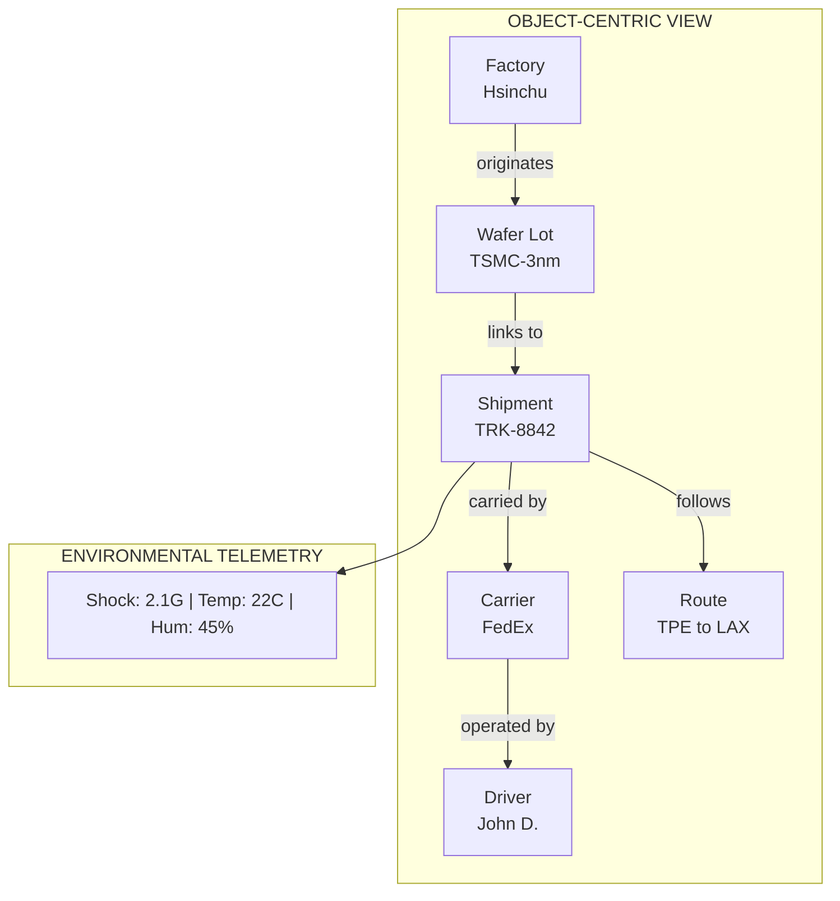
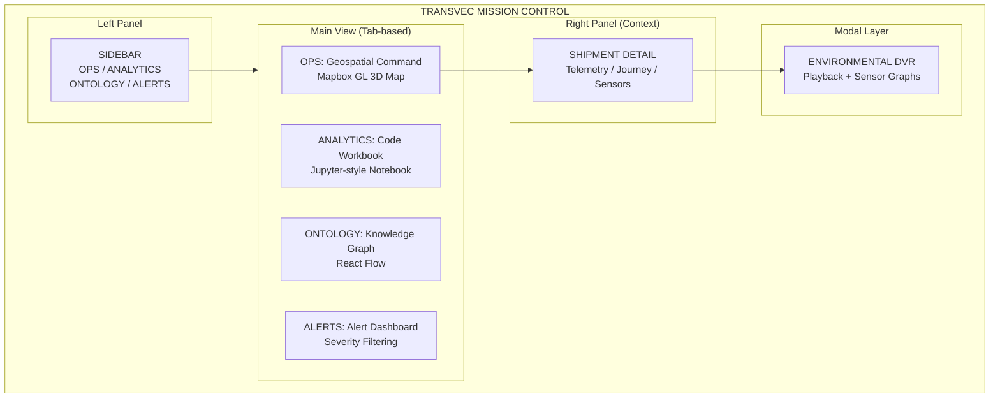
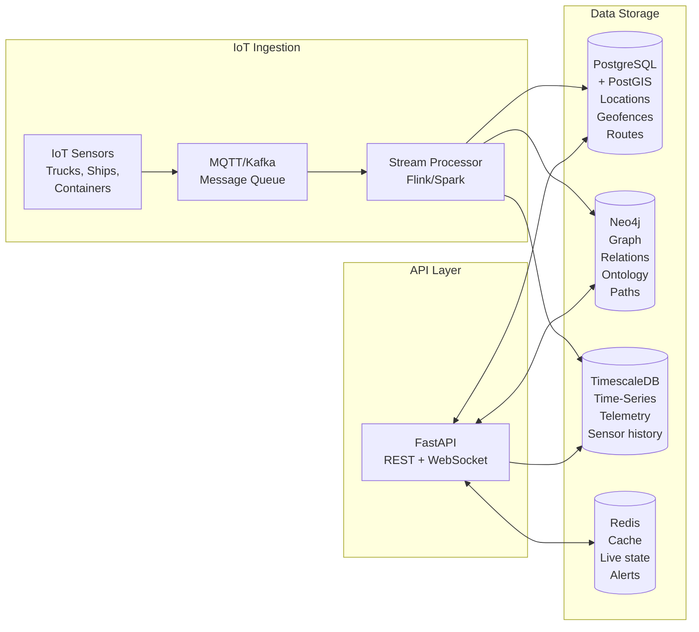
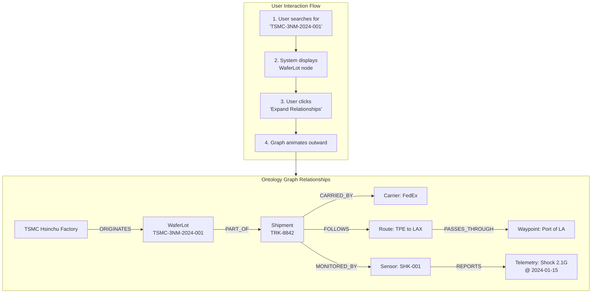
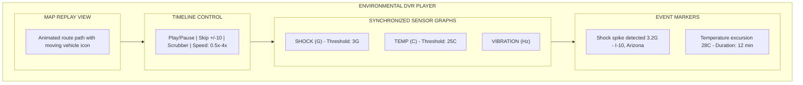
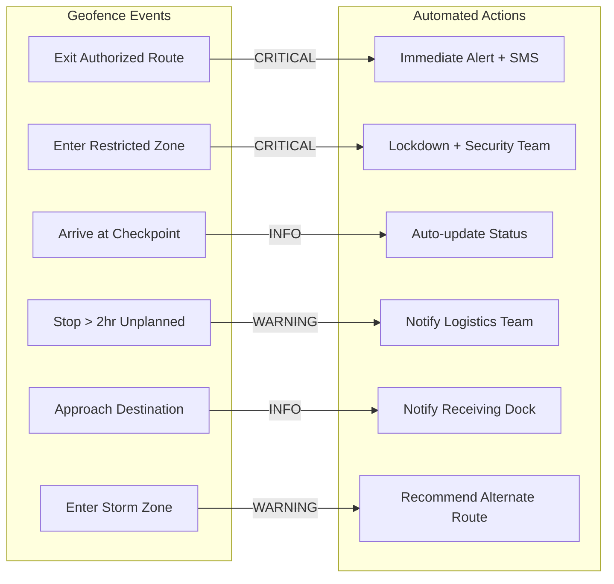
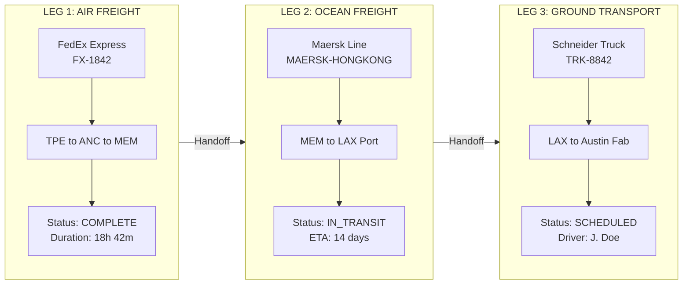
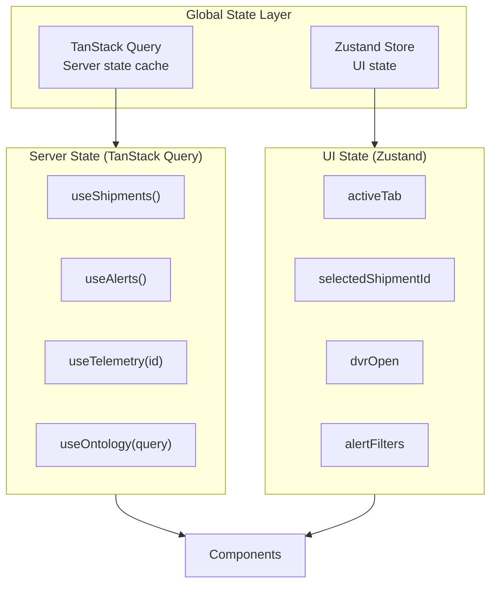

# Transvec

## Global Logistics Intelligence & Supply Chain Digital Twin

---

> **Tagline:** *"From Silicon to System: The Journey After the Fab."*

---

## 1. Executive Summary

**Transvec** is a high-fidelity logistics intelligence platform designed specifically for the semiconductor and high-tech manufacturing sectors. Target customers include industry leaders such as **TSMC**, **Intel**, **Tesla**, **Samsung**, and **AMD**.

Transvec serves as **"Part 3"** of the YieldOps ecosystem, completing the narrative by tracking critical assets **after they leave the manufacturing floor**:

| Phase | System | Purpose |
|-------|--------|---------|
| **Part 1** | YieldOps | Ensures the wafer is made correctly |
| **Part 2** | Sentinel Agent | Ensures the fab environment is safe |
| **Part 3** | **Transvec** | **Ensures the final product survives the journey** |

Acting as a **"Digital Twin"** of the global supply chain, Transvec ingests real-time telemetry--including shock, vibration, humidity, temperature, and GPS coordinates--to visualize the complex journey of sensitive merchandise from fabrication facilities to end-user assembly plants.

The platform utilizes an **Object-Centric interface** inspired by Palantir Foundry to reveal hidden relationships between suppliers, carriers, routes, and environmental risks that traditional linear tracking systems cannot expose.

---

## 2. The Narrative (The "Why")

### 2.1 The Problem with Current Systems

Today's supply chain tracking systems are fundamentally **linear and list-based**:

- Spreadsheet-style manifests
- Status updates at discrete checkpoints
- Reactive exception handling
- Siloed data across carriers and modes

### 2.2 Transvec is Graph-Based

Transvec reimagines logistics tracking as a **living, connected system**:



### 2.3 Critical Questions Transvec Answers

| Question | Business Impact |
|----------|-----------------|
| "Did the 3nm wafer lot experience >3G shock while on the truck in Arizona?" | Prevents $2M+ yield loss from damaged wafers |
| "Which specific shipments were delayed by the storm in the South China Sea?" | Enables proactive customer communication |
| "What is the real-time ETA for the A100 GPUs bound for the Austin fab?" | Optimizes production scheduling |
| "Has any shipment deviated from its approved route?" | Security and compliance verification |
| "Which carrier has the lowest shock incident rate for sensitive components?" | Data-driven vendor selection |

---

## 3. Technical Architecture

### 3.0 Key Architectural Challenges Solved

- Modeling multi-modal logistics in a unified ontology (air/sea/land with shared entities)
- Handling high-frequency telemetry without overloading transactional databases
- Designing geofence evaluation without O(n) polygon scans at scale
- Synchronizing graph + geospatial + time-series views in real time

### 3.1 Frontend: "The Mission Control Interface"

#### Visual Design Language

| Element | Specification |
|---------|---------------|
| **Background** | Deep dark mode `#10161a` (Palantir's signature void) |
| **Primary Accent** | Blue `#2D72D2` (active states, primary actions) |
| **Warning Accent** | Amber `#FFB000` (alerts, attention items) |
| **Critical Accent** | Red `#FF4D4F` (errors, critical alerts) |
| **Success Accent** | Green `#0F9960` (normal, resolved states) |
| **Data Density** | High-density, information-rich panels |
| **Typography** | Inter for UI, JetBrains Mono for data values and code |

> **Note:** The specification originally referenced Cyan `#00b3e6` as the primary accent. The implemented codebase uses `#2D72D2` (Blueprint-style blue), which provides better contrast ratios against the dark background and aligns with the Palantir Foundry aesthetic. All color tokens are defined in `tailwind.config.js` as the single source of truth.

#### Technology Stack (Implemented)

| Component | Technology | Rationale |
|-----------|------------|-----------|
| **Framework** | React 18 (TypeScript) | Type safety, component reusability, strict mode enabled |
| **Build Tool** | Vite 6 | Sub-second HMR, optimized production tree-shaking |
| **Styling** | Tailwind CSS 3.4 | Utility-first approach, purged production CSS, custom design tokens |
| **Geospatial Engine** | Mapbox GL JS 3.9 | 3D building rendering, dark theme, smooth marker animation |
| **Graph Visualization** | React Flow | Node-edge graph with expand/collapse, MiniMap, pan/zoom |
| **Charts** | Custom SVG | Zero-dependency sensor graphs in DVRTimeline (lightweight, 60fps) |
| **Fonts** | Inter + JetBrains Mono | Professional UI typography with monospace data display |

#### Technology Stack (Planned for Backend Integration)

| Component | Technology | Rationale |
|-----------|------------|-----------|
| **State Management** | TanStack Query (React Query) or Zustand | Cache management for live data, request deduplication |
| **Icon System** | Phosphor Icons (`@phosphor-icons/react`) | Installed, pending integration into UI components |
| **Analytics Charts** | Recharts | Installed, pending use for dashboard-level visualizations |
| **Map Abstraction** | react-map-gl | Installed, pending evaluation as declarative Mapbox wrapper |

#### UI Component Architecture



#### Component Inventory

| Component | File | Size | Description |
|-----------|------|------|-------------|
| **App** | `App.tsx` | 4.2K | Root layout shell, tab routing, shipment state |
| **Sidebar** | `Sidebar.tsx` | 5.7K | Vertical navigation, alert badge, settings placeholder |
| **MapView** | `MapView.tsx` | 10K | Mapbox GL 3D, markers, routes, stats overlay |
| **ShipmentDetail** | `ShipmentDetail.tsx` | 11K | Telemetry cards, journey timeline, sensor list |
| **CodeWorkbook** | `CodeWorkbook.tsx` | 8.3K | Markdown/code cells, syntax highlight, mock execution |
| **OntologyGraph** | `OntologyGraph.tsx` | 7K | React Flow nodes, edges, Cypher input, legend |
| **AlertPanel** | `AlertPanel.tsx` | 11K | Alert list, severity filter, acknowledge, detail view |
| **DVRTimeline** | `DVRTimeline.tsx` | 16K | Full-screen modal, map replay, SVG graphs, playback controls |

### 3.2 Backend: "The Intelligence Core" (Planned)

#### API Layer: FastAPI (Python)

**Why FastAPI:**

- **High Performance:** ASGI-based, async/await native
- **Real-time Streams:** WebSocket support for live telemetry ingestion
- **Data Science Integration:** Seamless integration with pandas, NumPy, scikit-learn
- **Automatic Documentation:** OpenAPI/Swagger generation
- **Proven:** Successfully deployed in HMAX-Lite

```python
# Core API Structure
app = FastAPI(title="Transvec Intelligence API")

# Telemetry Ingestion Endpoints
@app.post("/v1/telemetry/ingest")
async def ingest_telemetry(payload: TelemetryPayload):
    """Ingest real-time sensor data from IoT devices"""
    pass

# Geospatial Query Endpoints
@app.get("/v1/shipments/{shipment_id}/location")
async def get_shipment_location(shipment_id: UUID):
    """Get current geolocation with geofence status"""
    pass

# Graph Query Endpoints
@app.post("/v1/ontology/query")
async def query_ontology(cypher_query: str):
    """Execute Cypher queries against Neo4j graph"""
    pass

# Environmental DVR Endpoints
@app.get("/v1/shipments/{shipment_id}/history")
async def get_shipment_history(
    shipment_id: UUID,
    start_time: datetime,
    end_time: datetime
):
    """Retrieve time-series telemetry for playback"""
    pass
```

#### Spatial Database: PostgreSQL + PostGIS

**Why PostGIS:**

- **Industry Standard** for geospatial data
- **Geofencing Queries:** `ST_Contains()`, `ST_Intersects()` for polygon operations
- **Route Optimization:** Built-in routing algorithms
- **Scalability:** Handles millions of coordinate updates

```sql
-- Check if shipment is inside authorized zone
SELECT
    s.shipment_id,
    ST_Contains(az.geometry, s.current_location) as in_authorized_zone
FROM shipments s
JOIN authorized_zones az ON az.zone_id = s.approved_zone_id
WHERE s.shipment_id = 'TRK-8842';

-- Find all shipments within 50km of storm center
SELECT shipment_id, ST_Distance(current_location, storm_center) as distance
FROM shipments
WHERE ST_DWithin(current_location, storm_center, 50000);
```

#### Graph Database: Neo4j

**Why Neo4j:**

- **Relationship-First:** Native graph storage for complex supply chain relationships
- **Cypher Query Language:** Intuitive pattern matching
- **Pathfinding:** Shortest path, all paths between nodes
- **Inference:** Discover hidden connections (e.g., "Find all shipments handled by Driver A that reported damage")

```cypher
// Ontology Schema
(:WaferLot)-[:PART_OF]->(:Shipment)-[:CARRIED_BY]->(:Carrier)
(:Shipment)-[:FOLLOWS]->(:Route)-[:PASSES_THROUGH]->(:Waypoint)
(:Shipment)-[:MONITORED_BY]->(:Sensor)-[:REPORTS]->(:Telemetry)
(:Carrier)-[:OPERATED_BY]->(:Driver)
(:Factory)-[:ORIGINATES]->(:WaferLot)

// Find all shipments from TSMC Hsinchu that experienced shock >3G
MATCH (f:Factory {name: "TSMC Hsinchu"})-[:ORIGINATES]->(wl:WaferLot)
      -[:PART_OF]->(s:Shipment)-[:MONITORED_BY]->(sen:Sensor)
      -[:REPORTS]->(t:Telemetry {type: "shock"})
WHERE t.value > 3.0
RETURN s.shipment_id, s.current_status, t.value, t.timestamp
ORDER BY t.timestamp DESC;

// Trace complete supply chain for a specific wafer lot
MATCH path = (wl:WaferLot {lot_id: "TSMC-3NM-2024-001"})
      -[:PART_OF|CARRIED_BY|FOLLOWS|OPERATED_BY*]->(n)
RETURN path;
```

### 3.3 Data Architecture



---

## 4. Key Features & Modules

### 4.1 The "Ontology" Graph

**Concept:** Instead of flat relational tables, data is organized as **interconnected Objects**. Users can click any object and see a node graph expanding to reveal its relationships.

#### Object Types

| Object | Properties | Relationships |
|--------|------------|---------------|
| **Wafer Lot** | lot_id, process_node, fab_location, value | PART_OF -> Shipment, ORIGINATES_FROM -> Factory |
| **Shipment** | shipment_id, status, origin, destination, eta | CARRIED_BY -> Carrier, FOLLOWS -> Route, MONITORED_BY -> Sensor |
| **Carrier** | carrier_id, name, type (truck/ship/plane), rating | OPERATED_BY -> Driver, OWNS -> Vehicle |
| **Route** | route_id, waypoints, distance, estimated_duration | PASSES_THROUGH -> Waypoint, CONNECTS -> Factory |
| **Sensor** | sensor_id, type (GPS/shock/temp/humidity), status | REPORTS -> Telemetry, ATTACHED_TO -> Shipment |
| **Factory** | factory_id, name, location, iso_certification | ORIGINATES -> WaferLot, RECEIVES -> Shipment |

#### Implementation Status

| Feature | Status | Notes |
|---------|--------|-------|
| Node type rendering | Done | 6 node types with color coding and icons |
| Edge label animation | Done | Labeled, animated edges between nodes |
| Expand/collapse | Done | Click-to-expand node properties |
| MiniMap | Done | Corner navigator for large graphs |
| Cypher query input | UI only | Text input present, not connected to backend |
| Full ontology traversal | Planned | Requires Neo4j backend integration |

#### User Interaction Flow



### 4.2 Environmental "DVR" (Playback)

**Concept:** A time-series interface that allows operators to "scrub" through a shipment's history, replaying its journey with synchronized sensor data.

#### Implementation Status

| Feature | Status | Notes |
|---------|--------|-------|
| Full-screen modal | Done | Dark overlay, left map + right graphs layout |
| Map replay | Done | Animated position marker with route path |
| Shock graph | Done | SVG with 3G threshold line, anomaly highlighting |
| Temperature graph | Done | SVG with 25C threshold line |
| Vibration graph | Done | SVG waveform display |
| Playback controls | Done | Play/Pause, Skip, Timeline scrubber |
| Speed controls | Done | 0.5x, 1x, 2x, 4x |
| Event log | Done | Auto-detected anomalies with timestamps |
| Real data streaming | Planned | Currently uses 200-point synthetic dataset |

#### Interface Components



#### Use Cases

| Scenario | DVR Capability |
|----------|----------------|
| **Damage Investigation** | Pinpoint exact second and GPS coordinates where fragile component was dropped |
| **Insurance Claims** | Provide irrefutable evidence of handling conditions during transit |
| **Carrier Performance** | Compare shock profiles across different carriers on same route |
| **Route Optimization** | Identify road segments with consistently high vibration |

### 4.3 Geofence Sentinel (Planned)

**Concept:** Automated monitoring of asset location relative to defined geographic zones.

#### Zone Types

| Zone Type | Purpose | Example |
|-----------|---------|---------|
| **Authorized Route** | Define approved path | Highway I-10 between Phoenix and Los Angeles |
| **Restricted Area** | Alert on entry | High-crime zones, unauthorized countries |
| **Checkpoint** | Auto-update status | "Arrived at Port of Los Angeles" |
| **Proximity Alert** | Notify on approach | "10km from destination" |
| **Environmental Hazard** | Dynamic weather zones | Hurricane path, flood zones |

#### Alert Matrix



### 4.4 Multi-Modal Transport View

**Concept:** Unified tracking across air, sea, and land transportation modes.

#### Implementation Status

| Feature | Status | Notes |
|---------|--------|-------|
| Journey timeline | Done | ShipmentDetail shows leg-by-leg progress |
| Modal icons | Done | AIR / SEA / LAND with distinct styling |
| Leg status | Done | COMPLETE / IN_TRANSIT / SCHEDULED |
| Map route overlay | Done | Origin to current position visualization |
| Handoff transitions | Planned | Animated transitions between legs |



---

## 5. Frontend Performance Architecture

### 5.1 Critical Performance Rules

These rules are enforced from the React Performance Optimization Guide, prioritized by impact.

#### CRITICAL: Eliminate Waterfalls

| Rule | Application to Transvec |
|------|------------------------|
| **Defer await until needed** | When backend is integrated, move awaits into conditional branches (e.g., only fetch DVR data when modal opens) |
| **Use Promise.all()** | Parallelize shipment + telemetry + alert fetches on OPS tab load |
| **Strategic Suspense** | Wrap tab content in `<Suspense>` boundaries to stream layout while data loads |

```tsx
// WRONG: Sequential data fetching
const shipments = await fetchShipments()
const alerts = await fetchAlerts()
const telemetry = await fetchTelemetry(shipments[0].id)

// CORRECT: Parallel independent fetches
const [shipments, alerts] = await Promise.all([
  fetchShipments(),
  fetchAlerts()
])
// Dependent fetch after parallel batch
const telemetry = await fetchTelemetry(shipments[0].id)
```

#### CRITICAL: Bundle Size Optimization

| Rule | Application to Transvec |
|------|------------------------|
| **No barrel imports** | All component imports reference source files directly |
| **Dynamic imports for tabs** | CodeWorkbook, OntologyGraph, DVRTimeline are candidates for `React.lazy()` |
| **Tree-shake unused deps** | Remove or integrate `recharts`, `react-map-gl`, `@phosphor-icons/react` |

```tsx
// Code-split by tab: only load component when user navigates to that tab
const CodeWorkbook = React.lazy(() => import('./components/CodeWorkbook'))
const OntologyGraph = React.lazy(() => import('./components/OntologyGraph'))

// In render:
<Suspense fallback={<TabSkeleton />}>
  {activeTab === 'ANALYTICS' && <CodeWorkbook />}
  {activeTab === 'ONTOLOGY' && <OntologyGraph />}
</Suspense>
```

### 5.2 Re-render Optimization

| Rule | Application |
|------|-------------|
| **React.memo() for heavy components** | `ShipmentDetail`, `AlertPanel`, `DVRTimeline` receive stable props |
| **Defer state reads** | Alert count badge in Sidebar should read from derived state, not full alert array |
| **Lazy state initialization** | `useState(() => generateTelemetryHistory())` for expensive mock data generators |
| **useTransition for non-urgent updates** | Tab switching should use `startTransition` to avoid blocking marker animations |

### 5.3 Rendering Performance

| Rule | Application |
|------|-------------|
| **content-visibility: auto** | Apply to AlertPanel list items and DVR event log for scroll performance |
| **Hoist static JSX** | Move static SVG threshold lines and legends outside component render functions |
| **Explicit conditional rendering** | Use ternary `{condition ? <A/> : null}` instead of `{condition && <A/>}` to avoid falsy value rendering |
| **CSS animations over JS** | DVR playback marker pulse uses CSS `@keyframes`, not `requestAnimationFrame` |

### 5.4 Bundle Targets

| Chunk | Estimated Size | Load Strategy |
|-------|---------------|---------------|
| `core` (React, ReactDOM) | ~140KB gzip | Initial load |
| `mapbox-gl` | ~200KB gzip | Lazy on OPS tab |
| `react-flow-renderer` | ~60KB gzip | Lazy on ONTOLOGY tab |
| `app` (all components) | ~30KB gzip | Initial load (before code-splitting) |
| **Total initial** | ~170KB gzip | Target: <200KB gzip |

### 5.5 Metrics Targets

| Metric | Target | Measurement |
|--------|--------|-------------|
| **Largest Contentful Paint (LCP)** | < 2.5s | Lighthouse on production build |
| **First Input Delay (FID)** | < 100ms | Chrome DevTools Performance tab |
| **Cumulative Layout Shift (CLS)** | < 0.1 | Lighthouse |
| **Time to Interactive (TTI)** | < 3.5s | Lighthouse |
| **Initial bundle** | < 200KB gzip | `npx vite-bundle-visualizer` |

---

## 6. Security Architecture

### 6.1 Current State (Frontend Prototype)

| Area | Status | Risk Level |
|------|--------|------------|
| **API Keys** | Demo Mapbox token hardcoded in `MapView.tsx` | HIGH - Must move to env variable |
| **Source Maps** | Enabled in production build (`sourcemap: true`) | MEDIUM - Exposes source code |
| **Dependencies** | No audit performed | MEDIUM - Potential CVEs |
| **Input Validation** | No user input flows to backend (mock data only) | LOW - No attack surface yet |
| **Authentication** | None (prototype) | N/A - Required for production |

### 6.2 Production Security Requirements

| Layer | Requirement | Implementation |
|-------|-------------|----------------|
| **Authentication** | JWT-based auth with refresh tokens | FastAPI + OAuth2 password bearer |
| **Authorization** | Role-based access (Operator, Analyst, Admin) | Endpoint-level permission guards |
| **API Keys** | All secrets in environment variables | `.env` files, never committed |
| **CSP Headers** | Content-Security-Policy restricting script sources | Vite plugin or reverse proxy config |
| **HTTPS** | TLS 1.3 enforced | Deployment infrastructure |
| **Input Sanitization** | Cypher query parameterization | Prevent injection via Neo4j driver params |
| **Rate Limiting** | Throttle telemetry ingestion and API queries | FastAPI middleware |
| **Audit Logging** | Track all data access and mutations | Structured logging to observability stack |
| **Dependency Scanning** | Automated CVE detection in CI | `npm audit` + Snyk or Dependabot |

### 6.3 Sensitive Data Handling

| Data Type | Classification | Handling |
|-----------|---------------|----------|
| GPS coordinates | Confidential | Encrypt at rest, restrict API access |
| Wafer lot values | Confidential | Access controlled by role |
| Carrier contracts | Internal | Not exposed to frontend |
| Sensor telemetry | Internal | Retained per data retention policy |
| User credentials | Secret | Hashed (bcrypt), never logged |

---

## 7. Accessibility Requirements

### 7.1 Current State

The prototype is **desktop-optimized only** with the following gaps:

| Area | Current | Required |
|------|---------|----------|
| **ARIA Labels** | Missing on interactive elements | All buttons, inputs, and panels need labels |
| **Keyboard Navigation** | Not implemented | Tab order, Enter/Space activation, Escape to close modals |
| **Screen Reader** | Not tested | Semantic HTML, live regions for alerts |
| **Color Contrast** | Good (dark theme with bright text) | Verify 4.5:1 minimum for all text |
| **Focus Indicators** | Partial (accent outline in CSS) | Visible focus ring on all interactive elements |
| **Responsive Design** | Desktop only | Tablet breakpoint (1024px) minimum |

### 7.2 WCAG 2.1 AA Compliance Targets

| Guideline | Implementation |
|-----------|----------------|
| **1.1.1 Non-text Content** | Alt text for map markers, graph nodes |
| **1.3.1 Info and Relationships** | Semantic headings in all panels |
| **1.4.3 Contrast** | Minimum 4.5:1 for text, 3:1 for UI components |
| **2.1.1 Keyboard** | All functionality operable via keyboard |
| **2.4.7 Focus Visible** | Visible focus indicator on all interactive elements |
| **4.1.2 Name, Role, Value** | ARIA attributes on custom components |

---

## 8. Testing Strategy

### 8.1 Test Pyramid

| Layer | Tool | Coverage Target | Scope |
|-------|------|-----------------|-------|
| **Unit Tests** | Vitest | 80% | Utility functions, data transformers, type guards |
| **Component Tests** | Vitest + Testing Library | 70% | Component rendering, user interactions, state changes |
| **Integration Tests** | Vitest + MSW | 60% | API integration, data flow between components |
| **E2E Tests** | Playwright | Critical paths | Tab navigation, shipment selection, DVR playback |
| **Visual Regression** | Playwright screenshots | Key views | OPS map, Alert panel, DVR modal |

### 8.2 Critical Test Scenarios

| Scenario | Type | Priority |
|----------|------|----------|
| Tab navigation renders correct component | Component | P0 |
| Shipment selection updates detail panel | Integration | P0 |
| Alert filtering by severity | Component | P0 |
| DVR playback controls (play/pause/seek) | Component | P0 |
| Ontology node expand/collapse | Component | P1 |
| Map marker click triggers selection | Integration | P1 |
| Alert acknowledgment state persistence | Integration | P1 |
| Code workbook cell execution flow | Component | P2 |

---

## 9. State Management Architecture

### 9.1 Current: Local React State

All state is managed via `useState` in `App.tsx` and passed down as props:

```
App.tsx
  activeTab: ViewTab (OPS | ANALYTICS | ONTOLOGY | ALERTS)
  selectedShipment: Shipment | null
  showDVR: boolean
    |
    +-- Sidebar (activeTab, onTabChange)
    +-- MapView (shipments, onSelectShipment)
    +-- ShipmentDetail (shipment, onOpenDVR)
    +-- CodeWorkbook (shipment)
    +-- OntologyGraph ()
    +-- AlertPanel (alerts)
    +-- DVRTimeline (shipment, onClose)
```

### 9.2 Planned: Production State Architecture



| State Type | Manager | Rationale |
|-----------|---------|-----------|
| **Server data** (shipments, alerts, telemetry) | TanStack Query | Automatic caching, deduplication, background refetch |
| **UI state** (active tab, selected item, filters) | Zustand | Lightweight, no provider nesting, derived selectors |
| **Ephemeral state** (form inputs, hover states) | Local useState | Component-scoped, no need for global access |

---

## 10. Portfolio Evolution: From HMAX-Lite to Transvec

### 10.1 The Foundation (HMAX-Lite)

**HMAX-Lite** (Panama Metro Line 3 Digital Twin) established the core capabilities:

| Capability | HMAX-Lite Implementation |
|------------|-------------------------|
| Digital Twin | Real-time monorail physics simulation |
| Geofencing | Tunnel boundary detection |
| Telemetry | B-CHOP energy recovery monitoring |
| Backend | Python/FastAPI with async support |
| Frontend | React + Leaflet geospatial dashboard |
| State Sync | TanStack Query for real-time updates |
| Architecture | Microservices-based SCADA system |

### 10.2 The Evolution (Transvec)

| Dimension | HMAX-Lite | Transvec |
|-----------|-----------|----------|
| **Transport Mode** | Single (Monorail) | Multi-modal (Air/Sea/Land) |
| **Tracking Scope** | Linear (Tunnel A to B) | Global network with branching paths |
| **Data Model** | Relational (tables) | Graph-based (objects + relationships) |
| **Visualization** | Standard dashboard | High-density "Mission Control" UI |
| **Relationships** | Simple parent-child | Complex ontology (Supplier -> Part -> Shipment -> Carrier) |
| **Geospatial** | 2D map with single route | 3D map with multi-asset tracking |
| **UI Density** | Medium | High (Palantir-style) |

### 10.3 Skill Transfer Matrix

| HMAX-Lite Skill | Transvec Application |
|-----------------|---------------------|
| Tunnel Geofencing Logic | Customs Port Geofencing |
| Coordinate-in-Polygon (ST_Contains) | Global Zone Monitoring |
| Real-time State Sync (TanStack Query) | Live Fleet Tracking |
| Telemetry Physics Modeling | Environmental Telemetry (Shock/Vibration/Humidity) |
| SCADA Alert System | Multi-tier Alert Framework |

### 10.4 Portfolio Narrative

> **"You are not starting from scratch; you are scaling up your architecture. You already know how to build the engine; now you are building a bigger, more complex vehicle around it."**

| Level | Project | Scope | Complexity |
|-------|---------|-------|------------|
| **Level 1** | HMAX-Lite | Single-mode transport, linear tracking, standard dashboard | Foundation |
| **Level 2** | **Transvec** | Multi-modal global logistics, complex graph relationships, high-density Mission Control UI | **Scale** |

---

## 11. Implementation Roadmap

### Phase 1: Foundation (Weeks 1-4) -- COMPLETE

| Task | Deliverable | Status |
|------|-------------|--------|
| Project structure | React 18 + Vite 6 + TypeScript + Tailwind CSS | Done |
| Design system | Palantir-inspired dark theme tokens in `tailwind.config.js` | Done |
| Base map | Mapbox GL JS 3D with dark theme, markers, routes | Done |
| Type system | Full domain types for Shipment, Carrier, Sensor, Alert, etc. | Done |
| Mock data | 3 shipments, 5 carriers, 7 sensors, 4 alerts, telemetry history | Done |
| Core components | All 7 components built and functional | Done |

### Phase 2: Performance & Polish (Weeks 5-8)

| Task | Deliverable | Status |
|------|-------------|--------|
| Code-splitting | `React.lazy()` for CodeWorkbook, OntologyGraph, DVRTimeline | Planned |
| Dependency cleanup | Remove or integrate unused packages | Planned |
| React.memo | Memoize ShipmentDetail, AlertPanel | Planned |
| Error boundaries | Graceful fallback UI for component failures | Planned |
| Accessibility | ARIA labels, keyboard navigation, focus management | Planned |
| Environment variables | Move Mapbox token to `.env`, disable production source maps | Planned |

### Phase 3: Backend Integration (Weeks 9-12)

| Task | Deliverable | Status |
|------|-------------|--------|
| FastAPI scaffolding | REST endpoints + WebSocket support | Planned |
| PostgreSQL + PostGIS | Geospatial queries, geofence engine | Planned |
| Neo4j | Graph ontology with Cypher query support | Planned |
| State management | TanStack Query + Zustand migration | Planned |
| Real-time data | Replace mock data with API-backed fetches | Planned |

### Phase 4: Advanced Features (Weeks 13-16)

| Task | Deliverable | Status |
|------|-------------|--------|
| Real-time fleet tracking | 1000+ assets at 60fps via WebSocket | Planned |
| Geofence Sentinel | Polygon zones with automated alert triggers | Planned |
| AI anomaly detection | Isolation Forest / LSTM for telemetry analysis | Planned |
| Demo dataset | Realistic TSMC-to-Tesla shipment simulation | Planned |
| Testing | Vitest unit/component tests + Playwright E2E | Planned |
| Documentation | API docs, deployment guide, operations runbook | Planned |

---

## 12. Target Customer Profiles

### 12.1 Primary: Semiconductor Manufacturers

| Company | Use Case | Value Proposition |
|---------|----------|-------------------|
| **TSMC** | Track 3nm wafer lots from Taiwan to global customers | Prevent $2M+ yield loss from transit damage |
| **Intel** | Monitor A100/H100 GPU shipments to data centers | Ensure AI accelerator integrity |
| **Samsung** | Manage memory chip logistics for mobile OEMs | Optimize just-in-time delivery |
| **AMD** | Track EPYC processor shipments to cloud providers | Verify cold chain for sensitive components |

### 12.2 Secondary: High-Tech Manufacturers

| Company | Use Case | Value Proposition |
|---------|----------|-------------------|
| **Tesla** | Track battery cells from Gigafactory to assembly | Monitor temperature-sensitive lithium cells |
| **Apple** | Secure supply chain for A-series chips | Prevent leaks, verify chain of custody |
| **NVIDIA** | Manage GPU distribution to 100+ countries | Real-time inventory visibility |

---

## 13. Competitive Differentiation

| Feature | Traditional TMS | Transvec |
|---------|-----------------|----------|
| **Data Model** | Relational tables | Graph-based ontology |
| **Visualization** | List-based tracking | Mission Control interface |
| **Relationships** | Manual lookup | Automatic link analysis |
| **Environmental Data** | Basic temperature | Shock, vibration, humidity, GPS fusion |
| **Playback** | Static reports | Interactive DVR scrubbing |
| **Geofencing** | Simple checkpoints | Complex polygon zones with alerts |

---

## 14. Technical References

### 14.1 UI/UX Inspiration

| Source | Element |
|--------|---------|
| **Palantir Foundry** | Object-centric interface, dark theme, dense data panels |
| **Palantir AIP** | Natural language queries, AI-assisted analysis |
| **HMAX-Lite** | Real-time telemetry, geofencing logic, state sync |

### 14.2 Technology Stack Summary

| Layer | Technology |
|-------|------------|
| Frontend (Current) | React 18, TypeScript, Tailwind CSS, Mapbox GL JS, React Flow |
| Frontend (Planned) | TanStack Query, Zustand, Phosphor Icons, Recharts |
| Backend (Planned) | Python, FastAPI, async/await |
| Databases (Planned) | PostgreSQL + PostGIS, Neo4j, TimescaleDB, Redis |
| Streaming (Planned) | Apache Kafka, Apache Flink |
| DevOps (Planned) | Docker, Kubernetes, GitHub Actions |
| Testing (Planned) | Vitest, Playwright, MSW |

---

## 15. Conclusion

**Transvec** represents the natural evolution of the YieldOps ecosystem--from manufacturing floor to global supply chain. By leveraging the proven architecture of HMAX-Lite and applying Palantir-inspired design principles, Transvec delivers a next-generation logistics intelligence platform that transforms how semiconductor and high-tech companies track their most valuable assets.

> *"From Silicon to System: The Journey After the Fab."*

---

## Appendix A: UI Mockup References

The following images inform the visual design direction:

1. **Palantir Foundry Map Interface** - Map layers, data sources panel, code editor, chat interface
2. **YieldOps Dashboard** - Metric cards, Sand-to-Package Coverage, agent status
3. **Sentinel Agent Grid** - Agent cards with status indicators, grid/list toggle
4. **Sentinel Topology Graph** - Radial node graph, agent hierarchy visualization
5. **Safety Circuit** - Zone status, incident feed with severity indicators
6. **Knowledge Graph** - Node-edge visualization, central concepts
7. **HMAX-Lite Portfolio** - Project documentation, technology badges
8. **Military C2 Interface** - Tactical map, radar sweeps, mission timeline
9. **Palantir Global Ops** - 3D globe, situation tracking, response planning

---

## Appendix B: Design System Source of Truth

The authoritative design tokens are defined in the following files:

| File | Contains |
|------|----------|
| `tailwind.config.js` | Color palette, font families, animations |
| `src/index.css` | Custom scrollbars, animations, tooltip styles |
| `index.html` | Font preloads, Mapbox CSS |

Any discrepancy between this document and the codebase should be resolved in favor of the codebase. This specification is updated to reflect implementation decisions.

---

*Document Version: 2.0*
*Last Updated: February 2026*
*Author: Portfolio Development Team*
